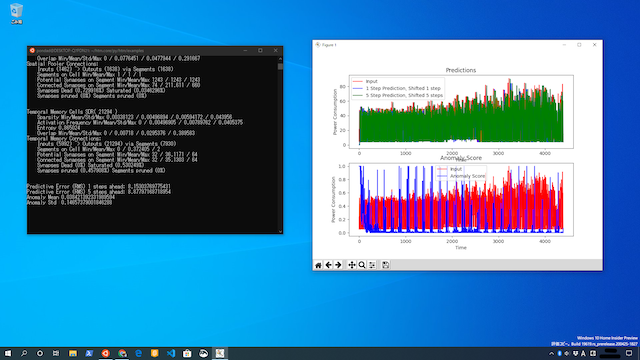

# Windows



### Windows10 WSL2

Windows10では、仮想マシンを使うことでLinuxカーネルを動作できます。ここではWSL2を利用してインストールします。

OSビルド 19624.1000 にてWSL2をインストール、Ubuntu18.04.4 LTS 、Python 3.6.9を利用します。

### **Pythonによるビルド**

インストールに関しては通常のUbuntuと同じ様にインストールしてください。

### Matplotlibの使用

WSL2でmatplotlibを使った画像出力をする際、別途Xserverを起動させなければなりません。Windows用のものは [VcXsrv](https://sourceforge.net/projects/vcxsrv/) からダウンロードしてください。VcXsrvの設定は全てデフォルトで良いのですが、1箇所 Extra settings: のDisable access control にチェックを入れてください。

仮想環境からディスプレイの指定をするため、以下の環境変数を指定してください。


```text
export DISPLAY=$(cat /etc/resolv.conf | grep nameserver | awk '{print $2}'):0
```



 

