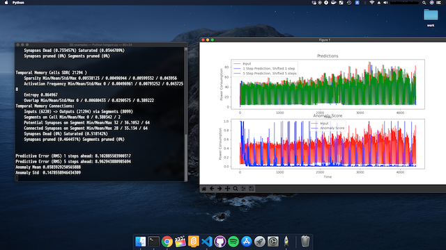

# macOS



### macOS Catalina

macOSに関しても1箇所をのぞき、Ubuntuと同じ手順でインストールがおこなえます。ここではmacOS Catalina 10.15.4 とPython 3.7.1 を使用します。

### **Pythonによるビルド**

コア部分であるC++をコンパイルするために、cmake、g++、clang++ などをインストールしてください。

Mac環境では、ビルドをおこなう前に環境変数の指定が必要になります。.bash\_profile に以下のように環境変数を指定してください。


```text
export ARCHFLAGS="-arch x86_64"
```


再起動後、Ubuntuと同様にインストールをおこないます。


