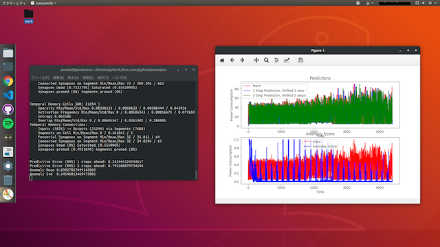

# Ubuntu



**Ubuntu18.04**

[htm.core](https://github.com/htm-community/htm.core) の設置方法を参考に、プラットフォームをインストールします。コア部分はC++ですが、API経由でPython3で利用できます。 

Ubuntuは依存関係の影響を受けにくいため、最も簡単にビルドすることができます。ここではUbuntu18.04でインストールします。

**Pythonによるビルド**

C++をコンパイルするために、cmake、g++、clang++ などが必要になります。もしインストールしていなければ事前にインストールしてください。

```text
$ git clone https://github.com/htm-community/htm.core.git
$ cd htm.core
$ python3 setup.py install
```


