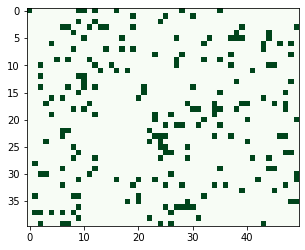

# SDRの測定ツール

SDR には、それを測定するためのツールがあります。`sdr.Metrics` クラスは、これらの測定ツールをすべて 1 つの便利なクラスにまとめたものです。コールバックを使用して SDR を自動的に追跡するように設定できます。

測定ツールは、指数平滑移動平均を使用してデータを組み込みます。これらの指数は、移動速度に関連するパラメータの期間によって制御されます。以下の3つのメトリクスを適用します。

* **`Sparsity`** （疎状態）
* **`ActivationFrequency`** （活性化頻度）
* **`Overlap`** （オーバーラップ）


指数平滑移動平均（Exponentially weighted Moving Average）

使用する全てのデータを平等に評価する単純移動平均（SMA）とは異なり、直近のデータを重視して移動平均を計算する方法の１つを指数平滑移動平均 Exponentially weighted Moving Average（EMAもしくはEWMA）といいます。


実際に実行してみましょう。


```python
from htm.bindings.sdr import SDR, Metrics
A = SDR( 2000 )
M = Metrics( A, period = 1000 )  #  これは自動的に SDR A を追跡します
for i in range( 3 ):
    A.randomize( sparsity = .10 )
    print(A)
print( M )
```


SDRを可視化してみます。



**`SDR.Metrics()`** による測定結果は以下のように出力されます。


```bash
SDR( 2000 )
    Sparsity Min/Mean/Std/Max 0.1 / 0.0999919 / 1.15105e-05 / 0.1
    Activation Frequency Min/Mean/Std/Max 0 / 0.0999997 / 0.176066 / 1
    Entropy 0.519853
    Overlap Min/Mean/Std/Max 0.115 / 0.122495 / 0.00750488 / 0.13
```


出力結果のサマリーは以下の様に各クラスのインスタンス（オブジェクト）を表現しています。

* **`M.sparsity`** -&gt; `Sparsity` クラスのインスタンス
* **`M.activationFrequency`** -&gt; `ActivationFrequency` クラスインスタンス
* **`M.overlap`** -&gt; `Overlap` クラスのインスタンス

\`\`


