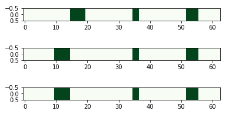

# 日付エンコーダー

日付エンコーダは、時刻と日付をエンコードします。 日付エンコーダへの入力は pythonモジュール `datetime.datetime` のオブジェクトです。

出力はいくつかのサブエンコーディングを連結したもので、それぞれが日付の異なる側面をエンコードします。

そしてそれらのサブエンコーディングは `DateEncode`rのコンストラクタで指定します。

### コンストラクタ

* **`season`** ：季節の幅を表現します。デフォルトは1シーズン=91.5日です。
* **`dayOfWeek`** ：平日の日数を表現します。デフォルトは1日です。
* **`weekend`** ：週末かどうか。0または1のビットで表現します。 （注意）実装では、金曜日の午後6時から日曜日の午前0時まで。
* **`holiday`** ：休日かどうか。0または1のビットで表現します。
* **`timeOfday`** ：一日の時間を表現します。

これらのコンストラクタを指定したサブエンコーディングをもとに、ひとつのSDRをエンコードします。実際にやってみましょう。

まず季節を4シーズンでコンストラクタを指定し、エンコードしたい日時を指定します。日時はPyhotnモジュールの`datetime.datetime` をつかって `datetime` オブジェクトへ変換します。


```python
import datetime
from htm.encoders.date import DateEncoder

dateEncoder = DateEncoder(season = 4) 

now = datetime.datetime.strptime("2019-05-02 13:08:58", "%Y-%m-%d %H:%M:%S")
nextMonth = datetime.datetime.strptime("2019-06-02 13:08:58", "%Y-%m-%d %H:%M:%S")
xmas = datetime.datetime.strptime("2019-12-25 13:08:58", "%Y-%m-%d %H:%M:%S")
```


エンコーダーのパラメータの指定ができました。特定の数値をエンコードします。


```python
print ("now =       ", dateEncoder.encode(now))
print ("next month =", dateEncoder.encode(nextMonth))
print ("xmas =      ", dateEncoder.encode(xmas))
```


エンコードされたSDRは以下のようになります。


```python
now =        SDR( 16 ) 5, 6, 7, 8
next month = SDR( 16 ) 7, 8, 9, 10
xmas =       SDR( 16 ) 0, 1, 2, 3
```


可視化してみます。



Numpy配列に形式を変換してみます。


```python
print ("now =       ", dateEncoder.encode(now).dense)
print ("next month =", dateEncoder.encode(nextMonth).dense)
print ("xmas =      ", dateEncoder.encode(xmas).dense)
```



```bash
now =        [0 0 0 0 0 1 1 1 1 0 0 0 0 0 0 0]
next month = [0 0 0 0 0 0 0 1 1 1 1 0 0 0 0 0]
xmas =       [1 1 1 1 0 0 0 0 0 0 0 0 0 0 0 0]
```


もう少し細かいコンストラクタを指定してみます。まず平日、週末をサブエンコーダーにより判断します。そして1日あたり6時間ごとに期間を設定します。


```python
dateEncoder = DateEncoder(dayOfWeek  = 5, weekend=2, timeOfDay=4) 

now = datetime.datetime.strptime("2019-05-02 13:08:58", "%Y-%m-%d %H:%M:%S")
nextMonth = datetime.datetime.strptime("2019-06-02 13:08:58", "%Y-%m-%d %H:%M:%S")
xmas = datetime.datetime.strptime("2019-12-25 13:08:58", "%Y-%m-%d %H:%M:%S")

print ("now =       ", dateEncoder.encode(now))
print ("next month =", dateEncoder.encode(nextMonth))
print ("xmas =      ", dateEncoder.encode(xmas))
```



```bash
now =        SDR( 63 ) 15, 16, 17, 18, 19, 35, 36, 52, 53, 54, 55
next month = SDR( 63 ) 30, 31, 32, 33, 34, 37, 38, 52, 53, 54, 55
xmas =       SDR( 63 ) 10, 11, 12, 13, 14, 35, 36, 52, 53, 54, 55
```


各オンビットは意味を持ちますので、もとのデータが近いと似たSDRがエンコードされることに注目してくだい。

**\`\`**

