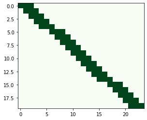

# スカラエンコーダー

ScalarEncoder は数値スカラー（浮動小数点）値をビットの配列にエンコードします。出力は1の連続するブロックを除いて0です。この連続ブロックの位置は入力値によって連続的に変化します。

エンコーダは内部的に使用するパラメータ構造が含まれており、すべてのフィールドは自動的に入力されます。

#### パラメーター

* **`activeBits`**：エンコードされた出力 SDR の真のビット数です。
* **`category`**：入力が列挙されたカテゴリであることを意味します。true の場合、このエンコーダは符号なし整数のみをエンコードし、すべての入力は一意で重複しない表現になります。
* **`clipInput`**：これは、入力値を \[最小値、最大値\] の範囲外の値を許可するかどうかを決定します。trueの場合、入力は範囲\[最小値、最大値\]にクリップされます。
* **`maximum`**：入力信号の範囲を定義します。これらのエンドポイントは包括的です。
* **`minimum`**：入力信号の範囲を定義します。これらのエンドポイントは包括的です。
* **`periodic`**：これは、入力範囲のエッジ付近で何が起こるかを制御します。 true の場合、入力値の最小値と最大値は隣接し、出力 SDR の最初のビットと最後のビットも隣接します。 1 の連続したブロックは、末尾から先頭へと回り込みます。
* **`radius`**：半径以上で区切られた2つの入力は、重複しない表現になります。
* **`resolution`**：解像度（オンビットの密度）以上で区切られた2つの入力は、異なる表現を持つことが保証されています。
* **`size`**：エンコードされた出力 SDR の総ビット数です。
* **`sparsity`**：これはアクティブビット数を指定する別の方法です。sparsityの場合はサイズも指定する必要があります。activeBitsかsparsityのどちらか一方のみを指定してください。

実際に数値データをエンコードしてみましょう。以下のサンプルでは、24ビットのSDR上に3つのオンビットで数値を表現します。数値の範囲は2.5〜97.5と指定し、範囲外の数値は最小値もしくは最大値へ変更するようにパラメータを設定します。


```python
from htm.bindings.encoders import ScalarEncoder, ScalarEncoderParameters
from htm.bindings.sdr import SDR

scalarEncoderParams = ScalarEncoderParameters()
scalarEncoderParams.minimum = 2.5
scalarEncoderParams.maximum = 97.5
scalarEncoderParams.activeBits = 3
scalarEncoderParams.size = 24
scalarEncoderParams.clipInput  = True

enc = ScalarEncoder(scalarEncoderParams)
```


エンコーダーのパラメータの指定ができました。特定の数値をエンコードします。


```python
print ("3 =", enc.encode(3))
print ("4 =", enc.encode(4))
print ("5 =", enc.encode(5))
```


エンコードされたSDRは以下のようになります。SDRのビット数が24と小さいため3と4は同じオンビットで表現されています。


```python
3 = SDR( 24 ) 0, 1, 2
4 = SDR( 24 ) 0, 1, 2
5 = SDR( 24 ) 1, 2, 3
```


前章でみたように、SDRのデータ形式は内容を破損することなく変換できます。Numpy配列に形式を変換してみます。


```python
print ("3 =", enc.encode(3).dense)
print ("4 =", enc.encode(4).dense)
print ("5 =", enc.encode(5).dense)
```



```bash
3 = [1 1 1 0 0 0 0 0 0 0 0 0 0 0 0 0 0 0 0 0 0 0 0 0]
4 = [1 1 1 0 0 0 0 0 0 0 0 0 0 0 0 0 0 0 0 0 0 0 0 0]
5 = [0 1 1 1 0 0 0 0 0 0 0 0 0 0 0 0 0 0 0 0 0 0 0 0]
```


最小値から最大値までのSDRを可視化すると以下のようになります。



最大値を97.5で設定した確認をします。


```python
print ("100  =", enc.encode(100))
print ("1000 =", enc.encode(1000))
```



```bash
100  = SDR( 23 ) 20, 21, 22
1000 = SDR( 23 ) 20, 21, 22
```


設定した最大値より大きな数値が、同じエンコーディングを取得することを確認してください。

