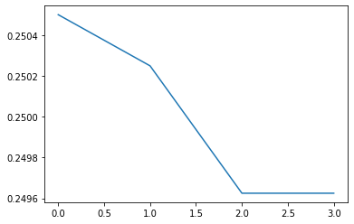

# 分類アルゴリズムの実装方法

分類アルゴリズムを実装します。分類アルゴリズムを使うためには、ラベルとデータのセットが必要になります。ここでは "cat", "dog", "monkey", "slow loris" の4つのラベルを用意します。


```python
import numpy as np
from htm.bindings.encoders import ScalarEncoder, ScalarEncoderParameters
from htm.bindings.sdr import SDR
from htm.algorithms import SpatialPooler as SP
from htm.bindings.algorithms import Classifier

categories = {"cat":0, "dog":1, "monkey":2, "slow loris":3}
```


スカラエンコーダーを定義します。4カテゴリーでカテゴリーあたり4ビットで指定しました。


```python
scalarEncoderParams = ScalarEncoderParameters()
scalarEncoderParams.minimum = 0
scalarEncoderParams.maximum = 3
scalarEncoderParams.activeBits = 4
scalarEncoderParams.category = True

enc = ScalarEncoder(scalarEncoderParams)
```


SPのパラメーターを設定します。


```python
inputSDR  = SDR( dimensions = (15, ) )
activeSDR = SDR( dimensions = (256, ) )
sp = SP(inputDimensions  = inputSDR.dimensions,
        columnDimensions = activeSDR.dimensions,
        localAreaDensity = 0.02,
        globalInhibition = True,
        seed             = 1,
        synPermActiveInc   = 0.01,
        synPermInactiveDec = 0.008)
```


分類アルゴリズムを定義します。


```python
clsr = Classifier()
```


バッジサイズを3で指定します。SP層の学習・推論とあわせて、分類器も学習します。


```python
batchSize=3
for n in range(batchSize):
    for i in range(len(categories)):
        inputSDR=enc.encode(i)
        sp.compute(inputSDR, True, activeSDR)
        print("Active Outputs: ",activeSDR)
        clsr.learn( activeSDR, list(categories.values())[i]  )
        print("Classifier learn: ",list(categories)[i] )
```


"cat"カテゴリーから一部アクティブセルが欠落し、"dog"の要素を含んだSDRを作成してテストしてみます。


```python
catdog=[1,1,0,1,0,1,0,0,0,0,0,0,0,0,0,0]
inputSDR = SDR(dimensions = (16, ))
inputSDR.dense = np.array(catdog)
print(inputSDR)
```



```bash
SDR( 16 ) 0, 1, 3, 5
```


分類器で分類します。


```python
sp.compute(inputSDR, False, activeSDR)
print("Active Outputs: ",activeSDR)
pdf = clsr.infer( activeSDR )
print("PDF: ",pdf)
predict = list(categories)[np.argmax( pdf )]  
print("predict index: ",predict)
```



```bash
Active Outputs:  SDR( 256 ) 208, 217, 223, 240, 248
PDF:  [0.2505001278091129, 0.25024944045838127, 0.24962522343597998, 0.24962522343597998]
predict index:  cat
```


"cat"と分類されました。PDFを可視化してみます。



"dog"を表す"1"の部分が反応しているのが分かります。バッジサイズ3で学習したのでこの結果になっていますが、学習回数が進み、シナプスの結合が強化されると"dog"への反応はなくなりますので注意してください。

