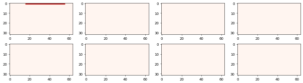
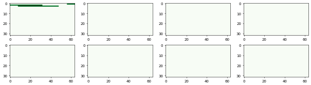

# TMの自己連想記憶

TMは異なるシーケンスを、どのように処理するのでしょうか。いくつかの基本的な特性を確認します。

"ABCDXY"という6つのカテゴリーを用意します。シーケンス"ABCD"とシーケンス"XBCY"を与えることで学習・予測がどの様に変化するかを確認します。


```python
import numpy as np
import random
random.seed(1)

from htm.bindings.sdr import SDR
from htm.algorithms import TemporalMemory as TM
```



```python
tm = TM(
  columnDimensions = (2048,),
  cellsPerColumn=8,
  initialPermanence=0.21,
  connectedPermanence=0.3,
  minThreshold=15,
  maxNewSynapseCount=40,
  permanenceIncrement=0.1,
  permanenceDecrement=0.1,
  activationThreshold=15,
  predictedSegmentDecrement=0.01,
  )
```


"ABCDXY"のカテゴリーはSPの出力を想定して、大きさ2048ビットでスパース値0.02%のSDRで表現します。


```python
sparsity   = 0.02
sparseCols = int(tm.numberOfColumns() * sparsity)
dataset    = {inp : SDR( tm.numberOfColumns() ) for inp in "ABCDXY"}
for i, inp in enumerate("ABCDXY"):
  dataset[inp].dense[ i * sparseCols : (i + 1) * sparseCols ] = 1
  dataset[inp].dense = dataset[inp].dense # この行は、SDR の高密度データが変更されたことを SDR に通知する.
  print("Input", inp, "is bits at indices: [",  i * sparseCols, '-', (i + 1) * sparseCols, ']')

seq1 = "ABCD"
seq2 = "XBCY"
seqT = "ABCDXY"
```



```bash
Input A is bits at indices: [ 0 - 40 ]
Input B is bits at indices: [ 40 - 80 ]
Input C is bits at indices: [ 80 - 120 ]
Input D is bits at indices: [ 120 - 160 ]
Input X is bits at indices: [ 160 - 200 ]
Input Y is bits at indices: [ 200 - 240 ]
```


1）まずは、シーケンス"ABCD"を10回学習させ、"ABCDXY"を1回づつ予測させます。


```python
tm.reset()
for t in range(10):
    for inp in seq1:
        v = SDR(dataset[inp])
        tm.compute( v, learn=True)
```



```python
for inp in seqT:
    print("--- " + inp + " ---")
    sdr = dataset[inp]
    tm.compute( sdr, learn=True)
    tm.activateDendrites(learn=True)
    activeColumnsIndices   = [tm.columnForCell(i) for i in tm.getActiveCells().sparse]
    predictedColumnIndices = [tm.columnForCell(i) for i in tm.getPredictiveCells().sparse]
    print("Active cols: " + str(sorted(set(activeColumnsIndices))))
    print("Predicted cols: " + str(sorted(set(predictedColumnIndices))))
    print("")
```



```bash
--- A ---
Active cols: [0, 1, 2, 3, 4, 5, 6, 7, 8, 9, 10, 11, 12, 13, 14, 15, 16, 17, 18, 19, 20, 21, 22, 23, 24, 25, 26, 27, 28, 29, 30, 31, 32, 33, 34, 35, 36, 37, 38, 39]
Predicted cols: [40, 41, 42, 43, 44, 45, 46, 47, 48, 49, 50, 51, 52, 53, 54, 55, 56, 57, 58, 59, 60, 61, 62, 63, 64, 65, 66, 67, 68, 69, 70, 71, 72, 73, 74, 75, 76, 77, 78, 79]

--- B ---
Active cols: [40, 41, 42, 43, 44, 45, 46, 47, 48, 49, 50, 51, 52, 53, 54, 55, 56, 57, 58, 59, 60, 61, 62, 63, 64, 65, 66, 67, 68, 69, 70, 71, 72, 73, 74, 75, 76, 77, 78, 79]
Predicted cols: [80, 81, 82, 83, 84, 85, 86, 87, 88, 89, 90, 91, 92, 93, 94, 95, 96, 97, 98, 99, 100, 101, 102, 103, 104, 105, 106, 107, 108, 109, 110, 111, 112, 113, 114, 115, 116, 117, 118, 119]

--- C ---
Active cols: [80, 81, 82, 83, 84, 85, 86, 87, 88, 89, 90, 91, 92, 93, 94, 95, 96, 97, 98, 99, 100, 101, 102, 103, 104, 105, 106, 107, 108, 109, 110, 111, 112, 113, 114, 115, 116, 117, 118, 119]
Predicted cols: [120, 121, 122, 123, 124, 125, 126, 127, 128, 129, 130, 131, 132, 133, 134, 135, 136, 137, 138, 139, 140, 141, 142, 143, 144, 145, 146, 147, 148, 149, 150, 151, 152, 153, 154, 155, 156, 157, 158, 159]

--- D ---
Active cols: [120, 121, 122, 123, 124, 125, 126, 127, 128, 129, 130, 131, 132, 133, 134, 135, 136, 137, 138, 139, 140, 141, 142, 143, 144, 145, 146, 147, 148, 149, 150, 151, 152, 153, 154, 155, 156, 157, 158, 159]
Predicted cols: [0, 1, 2, 3, 4, 5, 6, 7, 8, 9, 10, 11, 12, 13, 14, 15, 16, 17, 18, 19, 20, 21, 22, 23, 24, 25, 26, 27, 28, 29, 30, 31, 32, 33, 34, 35, 36, 37, 38, 39]

--- X ---
Active cols: [160, 161, 162, 163, 164, 165, 166, 167, 168, 169, 170, 171, 172, 173, 174, 175, 176, 177, 178, 179, 180, 181, 182, 183, 184, 185, 186, 187, 188, 189, 190, 191, 192, 193, 194, 195, 196, 197, 198, 199]
Predicted cols: []

--- Y ---
Active cols: [200, 201, 202, 203, 204, 205, 206, 207, 208, 209, 210, 211, 212, 213, 214, 215, 216, 217, 218, 219, 220, 221, 222, 223, 224, 225, 226, 227, 228, 229, 230, 231, 232, 233, 234, 235, 236, 237, 238, 239]
Predicted cols: []
```


"X"、"Y"の予測がされていないことを確認してください。

2）つづいてまずは、シーケンス"XBCY"を10回学習させます。**`tm.reset()`** で学習結果をリセットしますので注意してください。その後"ABCDXY"を1回づつ予測させます。


```python
for t in range(10):
    for inp in seq2:
        v = SDR(dataset[inp])
        tm.compute( v, learn=True)
```



```python
for inp in  seqT:
    print("--- " + inp + " ---")
    sdr = dataset[inp]
    tm.compute( sdr, learn=True)
    tm.activateDendrites(learn=True)
    activeColumnsIndices   = [tm.columnForCell(i) for i in tm.getActiveCells().sparse]
    predictedColumnIndices = [tm.columnForCell(i) for i in tm.getPredictiveCells().sparse]
    print("Active cols: " + str(sorted(set(activeColumnsIndices))))
    print("Predicted cols: " + str(sorted(set(predictedColumnIndices))))
    print("")
```



```bash
--- A ---
Active cols: [0, 1, 2, 3, 4, 5, 6, 7, 8, 9, 10, 11, 12, 13, 14, 15, 16, 17, 18, 19, 20, 21, 22, 23, 24, 25, 26, 27, 28, 29, 30, 31, 32, 33, 34, 35, 36, 37, 38, 39]
Predicted cols: []

--- B ---
Active cols: [40, 41, 42, 43, 44, 45, 46, 47, 48, 49, 50, 51, 52, 53, 54, 55, 56, 57, 58, 59, 60, 61, 62, 63, 64, 65, 66, 67, 68, 69, 70, 71, 72, 73, 74, 75, 76, 77, 78, 79]
Predicted cols: [80, 81, 82, 83, 84, 85, 86, 87, 88, 89, 90, 91, 92, 93, 94, 95, 96, 97, 98, 99, 100, 101, 102, 103, 104, 105, 106, 107, 108, 109, 110, 111, 112, 113, 114, 115, 116, 117, 118, 119]

--- C ---
Active cols: [80, 81, 82, 83, 84, 85, 86, 87, 88, 89, 90, 91, 92, 93, 94, 95, 96, 97, 98, 99, 100, 101, 102, 103, 104, 105, 106, 107, 108, 109, 110, 111, 112, 113, 114, 115, 116, 117, 118, 119]
Predicted cols: [200, 201, 202, 203, 204, 205, 206, 207, 208, 209, 210, 211, 212, 213, 214, 215, 216, 217, 218, 219, 220, 221, 222, 223, 224, 225, 226, 227, 228, 229, 230, 231, 232, 233, 234, 235, 236, 237, 238, 239]

--- D ---
Active cols: [120, 121, 122, 123, 124, 125, 126, 127, 128, 129, 130, 131, 132, 133, 134, 135, 136, 137, 138, 139, 140, 141, 142, 143, 144, 145, 146, 147, 148, 149, 150, 151, 152, 153, 154, 155, 156, 157, 158, 159]
Predicted cols: []

--- X ---
Active cols: [160, 161, 162, 163, 164, 165, 166, 167, 168, 169, 170, 171, 172, 173, 174, 175, 176, 177, 178, 179, 180, 181, 182, 183, 184, 185, 186, 187, 188, 189, 190, 191, 192, 193, 194, 195, 196, 197, 198, 199]
Predicted cols: [40, 41, 42, 43, 44, 45, 46, 47, 48, 49, 50, 51, 52, 53, 54, 55, 56, 57, 58, 59, 60, 61, 62, 63, 64, 65, 66, 67, 68, 69, 70, 71, 72, 73, 74, 75, 76, 77, 78, 79]

--- Y ---
Active cols: [200, 201, 202, 203, 204, 205, 206, 207, 208, 209, 210, 211, 212, 213, 214, 215, 216, 217, 218, 219, 220, 221, 222, 223, 224, 225, 226, 227, 228, 229, 230, 231, 232, 233, 234, 235, 236, 237, 238, 239]
Predicted cols: [160, 161, 162, 163, 164, 165, 166, 167, 168, 169, 170, 171, 172, 173, 174, 175, 176, 177, 178, 179, 180, 181, 182, 183, 184, 185, 186, 187, 188, 189, 190, 191, 192, 193, 194, 195, 196, 197, 198, 199]
```


"A"、"D"の予測がされていないことを確認してください。

3）最後に、シーケンス"ABCD"とシーケンス"XBCY"をランダムに100回学習させます。そして"ABCDXY"を1回づつ予測させます。


```python
for t in range(100):
  seq = random.choice([ seq1, seq2 ])
  for inp in seq:
    tm.compute( dataset[inp], learn=True)
```



```python
for inp in  seqT:
    print("--- " + inp + " ---")
    sdr = dataset[inp]
    tm.compute( sdr, learn=True)
    tm.activateDendrites(learn=True)
    activeColumnsIndices   = [tm.columnForCell(i) for i in tm.getActiveCells().sparse]
    predictedColumnIndices = [tm.columnForCell(i) for i in tm.getPredictiveCells().sparse]
    print("Active cols: " + str(sorted(set(activeColumnsIndices))))
    print("Predicted cols: " + str(sorted(set(predictedColumnIndices))))
    print("")
```



```bash
--- A ---
Active cols: [0, 1, 2, 3, 4, 5, 6, 7, 8, 9, 10, 11, 12, 13, 14, 15, 16, 17, 18, 19, 20, 21, 22, 23, 24, 25, 26, 27, 28, 29, 30, 31, 32, 33, 34, 35, 36, 37, 38, 39]
Predicted cols: [40, 41, 42, 43, 44, 45, 46, 47, 48, 49, 50, 51, 52, 53, 54, 55, 56, 57, 58, 59, 60, 61, 62, 63, 64, 65, 66, 67, 68, 69, 70, 71, 72, 73, 74, 75, 76, 77, 78, 79]

--- B ---
Active cols: [40, 41, 42, 43, 44, 45, 46, 47, 48, 49, 50, 51, 52, 53, 54, 55, 56, 57, 58, 59, 60, 61, 62, 63, 64, 65, 66, 67, 68, 69, 70, 71, 72, 73, 74, 75, 76, 77, 78, 79]
Predicted cols: [80, 81, 82, 83, 84, 85, 86, 87, 88, 89, 90, 91, 92, 93, 94, 95, 96, 97, 98, 99, 100, 101, 102, 103, 104, 105, 106, 107, 108, 109, 110, 111, 112, 113, 114, 115, 116, 117, 118, 119]

--- C ---
Active cols: [80, 81, 82, 83, 84, 85, 86, 87, 88, 89, 90, 91, 92, 93, 94, 95, 96, 97, 98, 99, 100, 101, 102, 103, 104, 105, 106, 107, 108, 109, 110, 111, 112, 113, 114, 115, 116, 117, 118, 119]
Predicted cols: [120, 121, 122, 123, 124, 125, 126, 127, 128, 129, 130, 131, 132, 133, 134, 135, 136, 137, 138, 139, 140, 141, 142, 143, 144, 145, 146, 147, 148, 149, 150, 151, 152, 153, 154, 155, 156, 157, 158, 159, 200, 201, 202, 203, 204, 205, 206, 207, 208, 209, 210, 211, 212, 213, 214, 215, 216, 217, 218, 219, 220, 221, 222, 223, 224, 225, 226, 227, 228, 229, 230, 231, 232, 233, 234, 235, 236, 237, 238, 239]

--- D ---
Active cols: [120, 121, 122, 123, 124, 125, 126, 127, 128, 129, 130, 131, 132, 133, 134, 135, 136, 137, 138, 139, 140, 141, 142, 143, 144, 145, 146, 147, 148, 149, 150, 151, 152, 153, 154, 155, 156, 157, 158, 159]
Predicted cols: [0, 1, 2, 3, 4, 5, 6, 7, 8, 9, 10, 11, 12, 13, 14, 15, 16, 17, 18, 19, 20, 21, 22, 23, 24, 25, 26, 27, 28, 29, 30, 31, 32, 33, 34, 35, 36, 37, 38, 39, 160, 161, 162, 163, 164, 165, 166, 167, 168, 169, 170, 171, 172, 173, 174, 175, 176, 177, 178, 179, 180, 181, 182, 183, 184, 185, 186, 187, 188, 189, 190, 191, 192, 193, 194, 195, 196, 197, 198, 199]

--- X ---
Active cols: [160, 161, 162, 163, 164, 165, 166, 167, 168, 169, 170, 171, 172, 173, 174, 175, 176, 177, 178, 179, 180, 181, 182, 183, 184, 185, 186, 187, 188, 189, 190, 191, 192, 193, 194, 195, 196, 197, 198, 199]
Predicted cols: [40, 41, 42, 43, 44, 45, 46, 47, 48, 49, 50, 51, 52, 53, 54, 55, 56, 57, 58, 59, 60, 61, 62, 63, 64, 65, 66, 67, 68, 69, 70, 71, 72, 73, 74, 75, 76, 77, 78, 79]

--- Y ---
Active cols: [200, 201, 202, 203, 204, 205, 206, 207, 208, 209, 210, 211, 212, 213, 214, 215, 216, 217, 218, 219, 220, 221, 222, 223, 224, 225, 226, 227, 228, 229, 230, 231, 232, 233, 234, 235, 236, 237, 238, 239]
Predicted cols: [0, 1, 2, 3, 4, 5, 6, 7, 8, 9, 10, 11, 12, 13, 14, 15, 16, 17, 18, 19, 20, 21, 22, 23, 24, 25, 26, 27, 28, 29, 30, 31, 32, 33, 34, 35, 36, 37, 38, 39, 160, 161, 162, 163, 164, 165, 166, 167, 168, 169, 170, 171, 172, 173, 174, 175, 176, 177, 178, 179, 180, 181, 182, 183, 184, 185, 186, 187, 188, 189, 190, 191, 192, 193, 194, 195, 196, 197, 198, 199]
```


ここではカテゴリー"C"に注目してください。予測したミニカラムは"D"と"Y"を内在した表現になっています。

TMのアクティブセルの抽出は、**`tm.getActiveCells()`**  メソッドを使用します。

一時記憶の予測セルの抽出は、**`tm.getPredictiveCells()`**  メソッドを使用します。


```python
for inp in  seqT:
    sdr = dataset[inp]

    tm.compute( sdr, learn=True)
    tm.activateDendrites(learn=True)

    print("Active sdr: ", tm.getActiveCells())    
    print("Predicted sdr: ",tm.getPredictiveCells())
```



```bash
--- A ---
Active sdr:  SDR( 2048, 8 ) 0, 8, 16, 24, 32, 40, 48, 56, 64, 72, 80, 88, 96, 104, 112, 120, 128, 136, 144, 152, 160, 168, 176, 184, 192, 200, 208, 216, 224, 232, 240, 248, 256, 264, 272, 280, 288, 296, 304, 312
Predicted sdr:  SDR( 2048, 8 ) 321, 329, 337, 345, 353, 361, 369, 377, 385, 393, 401, 409, 417, 425, 433, 441, 449, 457, 465, 473, 481, 489, 497, 505, 513, 521, 529, 537, 545, 553, 561, 569, 577, 585, 593, 601, 609, 617, 625, 633
--- B ---
Active sdr:  SDR( 2048, 8 ) 321, 329, 337, 345, 353, 361, 369, 377, 385, 393, 401, 409, 417, 425, 433, 441, 449, 457, 465, 473, 481, 489, 497, 505, 513, 521, 529, 537, 545, 553, 561, 569, 577, 585, 593, 601, 609, 617, 625, 633
Predicted sdr:  SDR( 2048, 8 ) 641, 649, 657, 665, 673, 681, 689, 697, 705, 713, 721, 729, 737, 745, 753, 761, 769, 777, 785, 793, 801, 809, 817, 825, 833, 841, 849, 857, 865, 873, 881, 889, 897, 905, 913, 921, 929, 937, 945, 953
--- C ---
Active sdr:  SDR( 2048, 8 ) 641, 649, 657, 665, 673, 681, 689, 697, 705, 713, 721, 729, 737, 745, 753, 761, 769, 777, 785, 793, 801, 809, 817, 825, 833, 841, 849, 857, 865, 873, 881, 889, 897, 905, 913, 921, 929, 937, 945, 953
Predicted sdr:  SDR( 2048, 8 ) 961, 969, 977, 985, 993, 1001, 1009, 1017, 1025, 1033, 1041, 1049, 1057, 1065, 1073, 1081, 1089, 1097, 1105, 1113, 1121, 1129, 1137, 1145, 1153, 1161, 1169, 1177, 1185, 1193, 1201, 1209, 1217, 1225, 1233, 1241, 1249, 1257, 1265, 1273
--- D ---
Active sdr:  SDR( 2048, 8 ) 961, 969, 977, 985, 993, 1001, 1009, 1017, 1025, 1033, 1041, 1049, 1057, 1065, 1073, 1081, 1089, 1097, 1105, 1113, 1121, 1129, 1137, 1145, 1153, 1161, 1169, 1177, 1185, 1193, 1201, 1209, 1217, 1225, 1233, 1241, 1249, 1257, 1265, 1273
Predicted sdr:  SDR( 2048, 8 ) 1, 9, 17, 25, 33, 41, 49, 57, 65, 73, 81, 89, 97, 105, 113, 121, 129, 137, 145, 153, 161, 169, 177, 185, 193, 201, 209, 217, 225, 233, 241, 249, 257, 265, 273, 281, 289, 297, 305, 313, 1282, 1290, 1298, 1306, 1314, 1322, 1330, 1338, 1346, 1354, 1362, 1370, 1378, 1386, 1394, 1402, 1410, 1418, 1426, 1434, 1442, 1450, 1458, 1466, 1474, 1482, 1490, 1498, 1506, 1514, 1522, 1530, 1538, 1546, 1554, 1562, 1570, 1578, 1586, 1594
--- X ---
Active sdr:  SDR( 2048, 8 ) 1282, 1290, 1298, 1306, 1314, 1322, 1330, 1338, 1346, 1354, 1362, 1370, 1378, 1386, 1394, 1402, 1410, 1418, 1426, 1434, 1442, 1450, 1458, 1466, 1474, 1482, 1490, 1498, 1506, 1514, 1522, 1530, 1538, 1546, 1554, 1562, 1570, 1578, 1586, 1594
Predicted sdr:  SDR( 2048, 8 ) 325, 333, 341, 349, 357, 365, 373, 381, 389, 397, 405, 413, 421, 429, 437, 445, 453, 461, 469, 477, 485, 493, 501, 509, 517, 525, 533, 541, 549, 557, 565, 573, 581, 589, 597, 605, 613, 621, 629, 637
--- Y ---
Active sdr:  SDR( 2048, 8 ) 1600, 1601, 1602, 1603, 1604, 1605, 1606, 1607, 1608, 1609, 1610, 1611, 1612, 1613, 1614, 1615, 1616, 1617, 1618, 1619, 1620, 1621, 1622, 1623, 1624, 1625, 1626, 1627, 1628, 1629, 1630, 1631, 1632, 1633, 1634, 1635, 1636, 1637, 1638, 1639, 1640, 1641, 1642, 1643, 1644, 1645, 1646, 1647, 1648, 1649, 1650, 1651, 1652, 1653, 1654, 1655, 1656, 1657, 1658, 1659, 1660, 1661, 1662, 1663, 1664, 1665, 1666, 1667, 1668, 1669, 1670, 1671, 1672, 1673, 1674, 1675, 1676, 1677, 1678, 1679, 1680, 1681, 1682, 1683, 1684, 1685, 1686, 1687, 1688, 1689, 1690, 1691, 1692, 1693, 1694, 1695, 1696, 1697, 1698, 1699, 1700, 1701, 1702, 1703, 1704, 1705, 1706, 1707, 1708, 1709, 1710, 1711, 1712, 1713, 1714, 1715, 1716, 1717, 1718, 1719, 1720, 1721, 1722, 1723, 1724, 1725, 1726, 1727, 1728, 1729, 1730, 1731, 1732, 1733, 1734, 1735, 1736, 1737, 1738, 1739, 1740, 1741, 1742, 1743, 1744, 1745, 1746, 1747, 1748, 1749, 1750, 1751, 1752, 1753, 1754, 1755, 1756, 1757, 1758, 1759, 1760, 1761, 1762, 1763, 1764, 1765, 1766, 1767, 1768, 1769, 1770, 1771, 1772, 1773, 1774, 1775, 1776, 1777, 1778, 1779, 1780, 1781, 1782, 1783, 1784, 1785, 1786, 1787, 1788, 1789, 1790, 1791, 1792, 1793, 1794, 1795, 1796, 1797, 1798, 1799, 1800, 1801, 1802, 1803, 1804, 1805, 1806, 1807, 1808, 1809, 1810, 1811, 1812, 1813, 1814, 1815, 1816, 1817, 1818, 1819, 1820, 1821, 1822, 1823, 1824, 1825, 1826, 1827, 1828, 1829, 1830, 1831, 1832, 1833, 1834, 1835, 1836, 1837, 1838, 1839, 1840, 1841, 1842, 1843, 1844, 1845, 1846, 1847, 1848, 1849, 1850, 1851, 1852, 1853, 1854, 1855, 1856, 1857, 1858, 1859, 1860, 1861, 1862, 1863, 1864, 1865, 1866, 1867, 1868, 1869, 1870, 1871, 1872, 1873, 1874, 1875, 1876, 1877, 1878, 1879, 1880, 1881, 1882, 1883, 1884, 1885, 1886, 1887, 1888, 1889, 1890, 1891, 1892, 1893, 1894, 1895, 1896, 1897, 1898, 1899, 1900, 1901, 1902, 1903, 1904, 1905, 1906, 1907, 1908, 1909, 1910, 1911, 1912, 1913, 1914, 1915, 1916, 1917, 1918, 1919
Predicted sdr:  SDR( 2048, 8 ) 0, 3, 8, 11, 16, 19, 24, 27, 32, 35, 40, 43, 48, 51, 56, 59, 64, 67, 72, 75, 80, 83, 88, 91, 96, 99, 104, 107, 112, 115, 120, 123, 128, 131, 136, 139, 144, 147, 152, 155, 160, 163, 168, 171, 176, 179, 184, 187, 192, 195, 200, 203, 208, 211, 216, 219, 224, 227, 232, 235, 240, 243, 248, 251, 256, 259, 264, 267, 272, 275, 280, 283, 288, 291, 296, 299, 304, 307, 312, 315, 1281, 1284, 1289, 1292, 1297, 1300, 1305, 1308, 1313, 1316, 1321, 1324, 1329, 1332, 1337, 1340, 1345, 1348, 1353, 1356, 1361, 1364, 1369, 1372, 1377, 1380, 1385, 1388, 1393, 1396, 1401, 1404, 1409, 1412, 1417, 1420, 1425, 1428, 1433, 1436, 1441, 1444, 1449, 1452, 1457, 1460, 1465, 1468, 1473, 1476, 1481, 1484, 1489, 1492, 1497, 1500, 1505, 1508, 1513, 1516, 1521, 1524, 1529, 1532, 1537, 1540, 1545, 1548, 1553, 1556, 1561, 1564, 1569, 1572, 1577, 1580, 1585, 1588, 1593, 1596
```


TM層は入力次元 × **`cellsPerColumn`** （ここでは8）であることに注目してください。"C"入力時のアクティブセルと予測セルを可視化すると以下の様になります。





予測セルが"D"と"Y"を内在した表現になっていることを確認してください。

