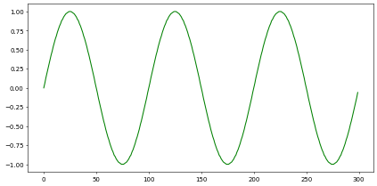
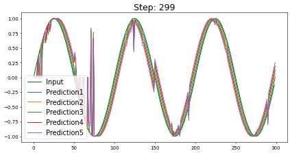
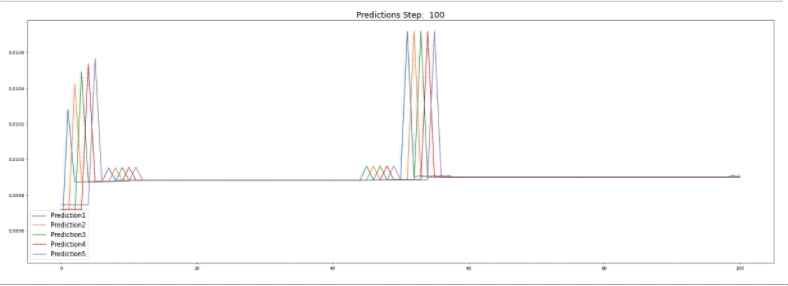

# 予測アルゴリズムの実装方法

予測アルゴリズムを実装します。予測アルゴリズムを使うためには、時系列ごとのラベル（バケットインデックス）とデータのセットが必要になります。ここでは300ステップで3周期となるsine波を用意します。


```python
import numpy as np

rows = 300
sine_wave={}

for i in range(rows):
    angle = (i * np.pi) / 50.0
    sine_value = np.sin(angle)
    sine_wave[i]=round(sine_value,2)
print(sine_wave)
```




出力は以下の通りです。


```bash
{0: 0.0, 1: 0.06, 2: 0.13, 3: 0.19, 4: 0.25, 5: 0.31, 6: 0.37, 7: 0.43, 8: 0.48, 9: 0.54, 10: 0.59, 11: 0.64, 12: 0.68, 13: 0.73, 14: 0.77, 15: 0.81, 16: 0.84, 17: 0.88, 18: 0.9, 19: 0.93, 20: 0.95, 21: 0.97, 22: 0.98, 23: 0.99, 24: 1.0, 25: 1.0, 26: 1.0, 27: 0.99, 28: 0.98, 29: 0.97, 30: 0.95, 31: 0.93, 32: 0.9, 33: 0.88, 34: 0.84, 35: 0.81, 36: 0.77, 37: 0.73, 38: 0.68, 39: 0.64, 40: 0.59, 41: 0.54, 42: 0.48, 43: 0.43, 44: 0.37, 45: 0.31, 46: 0.25, 47: 0.19, 48: 0.13, 49: 0.06, 50: 0.0, 51: -0.06, 52: -0.13, 53: -0.19, 54: -0.25, 55: -0.31, 56: -0.37, 57: -0.43, 58: -0.48, 59: -0.54, 60: -0.59, 61: -0.64, 62: -0.68, 63: -0.73, 64: -0.77, 65: -0.81, 66: -0.84, 67: -0.88, 68: -0.9, 69: -0.93, 70: -0.95, 71: -0.97, 72: -0.98, 73: -0.99, 74: -1.0, 75: -1.0, 76: -1.0, 77: -0.99, 78: -0.98, 79: -0.97, 80: -0.95, 81: -0.93, 82: -0.9, 83: -0.88, 84: -0.84, 85: -0.81, 86: -0.77, 87: -0.73, 88: -0.68, 89: -0.64, 90: -0.59, 91: -0.54, 92: -0.48, 93: -0.43, 94: -0.37, 95: -0.31, 96: -0.25, 97: -0.19, 98: -0.13, 99: -0.06, 100: -0.0, 101: 0.06, 102: 0.13, 103: 0.19, 104: 0.25, 105: 0.31, 106: 0.37, 107: 0.43, 108: 0.48, 109: 0.54, 110: 0.59, 111: 0.64, 112: 0.68, 113: 0.73, 114: 0.77, 115: 0.81, 116: 0.84, 117: 0.88, 118: 0.9, 119: 0.93, 120: 0.95, 121: 0.97, 122: 0.98, 123: 0.99, 124: 1.0, 125: 1.0, 126: 1.0, 127: 0.99, 128: 0.98, 129: 0.97, 130: 0.95, 131: 0.93, 132: 0.9, 133: 0.88, 134: 0.84, 135: 0.81, 136: 0.77, 137: 0.73, 138: 0.68, 139: 0.64, 140: 0.59, 141: 0.54, 142: 0.48, 143: 0.43, 144: 0.37, 145: 0.31, 146: 0.25, 147: 0.19, 148: 0.13, 149: 0.06, 150: 0.0, 151: -0.06, 152: -0.13, 153: -0.19, 154: -0.25, 155: -0.31, 156: -0.37, 157: -0.43, 158: -0.48, 159: -0.54, 160: -0.59, 161: -0.64, 162: -0.68, 163: -0.73, 164: -0.77, 165: -0.81, 166: -0.84, 167: -0.88, 168: -0.9, 169: -0.93, 170: -0.95, 171: -0.97, 172: -0.98, 173: -0.99, 174: -1.0, 175: -1.0, 176: -1.0, 177: -0.99, 178: -0.98, 179: -0.97, 180: -0.95, 181: -0.93, 182: -0.9, 183: -0.88, 184: -0.84, 185: -0.81, 186: -0.77, 187: -0.73, 188: -0.68, 189: -0.64, 190: -0.59, 191: -0.54, 192: -0.48, 193: -0.43, 194: -0.37, 195: -0.31, 196: -0.25, 197: -0.19, 198: -0.13, 199: -0.06, 200: -0.0, 201: 0.06, 202: 0.13, 203: 0.19, 204: 0.25, 205: 0.31, 206: 0.37, 207: 0.43, 208: 0.48, 209: 0.54, 210: 0.59, 211: 0.64, 212: 0.68, 213: 0.73, 214: 0.77, 215: 0.81, 216: 0.84, 217: 0.88, 218: 0.9, 219: 0.93, 220: 0.95, 221: 0.97, 222: 0.98, 223: 0.99, 224: 1.0, 225: 1.0, 226: 1.0, 227: 0.99, 228: 0.98, 229: 0.97, 230: 0.95, 231: 0.93, 232: 0.9, 233: 0.88, 234: 0.84, 235: 0.81, 236: 0.77, 237: 0.73, 238: 0.68, 239: 0.64, 240: 0.59, 241: 0.54, 242: 0.48, 243: 0.43, 244: 0.37, 245: 0.31, 246: 0.25, 247: 0.19, 248: 0.13, 249: 0.06, 250: 0.0, 251: -0.06, 252: -0.13, 253: -0.19, 254: -0.25, 255: -0.31, 256: -0.37, 257: -0.43, 258: -0.48, 259: -0.54, 260: -0.59, 261: -0.64, 262: -0.68, 263: -0.73, 264: -0.77, 265: -0.81, 266: -0.84, 267: -0.88, 268: -0.9, 269: -0.93, 270: -0.95, 271: -0.97, 272: -0.98, 273: -0.99, 274: -1.0, 275: -1.0, 276: -1.0, 277: -0.99, 278: -0.98, 279: -0.97, 280: -0.95, 281: -0.93, 282: -0.9, 283: -0.88, 284: -0.84, 285: -0.81, 286: -0.77, 287: -0.73, 288: -0.68, 289: -0.64, 290: -0.59, 291: -0.54, 292: -0.48, 293: -0.43, 294: -0.37, 295: -0.31, 296: -0.25, 297: -0.19, 298: -0.13, 299: -0.06}

```


ライブラリをインポートし、エンコーダー・SP・TMを定義します。


```python
import numpy as np

from htm.bindings.sdr import SDR
from htm.bindings.encoders import ScalarEncoder, ScalarEncoderParameters
from htm.algorithms import SpatialPooler as SP
from htm.algorithms import TemporalMemory as TM
from htm.bindings.algorithms import Predictor

scalarEncoderParams = ScalarEncoderParameters()
scalarEncoderParams.minimum = -1
scalarEncoderParams.maximum = 1
scalarEncoderParams.activeBits = 4
scalarEncoderParams.size = 128
scalarEncoderParams.clipInput  = True

enc = ScalarEncoder(scalarEncoderParams)

inputSDR  = SDR( dimensions = (128, ) )
activeSDR = SDR( dimensions = (576,) )
sp = SP(inputDimensions  = inputSDR.dimensions,
        columnDimensions = activeSDR.dimensions,
        localAreaDensity = 0.02,
        globalInhibition = True,
        seed             = 1,
        synPermActiveInc   = 0.01,
        synPermInactiveDec = 0.008)

tm = TM(
    columnDimensions = (576,),
    cellsPerColumn=8,
    initialPermanence=0.5,
    connectedPermanence=0.5,
    minThreshold=8,
    maxNewSynapseCount=20,
    permanenceIncrement=0.1,
    permanenceDecrement=0.0,
    activationThreshold=8,
)
```


**`Predictor()`** のステップ数を定義します。


```python
predictor = Predictor( steps=[1,2,3,4,5])
```


**`predictor.learn(ステップ数, アクティブセル, バケットインデックス)`** でステップ順にアクティブセルとバケットインデックスを学習します。

**`predictor.infer( アクティブセル)`** によりバケットインデックスの推測（尤度）が算出されるので、尤度が一番高いバケットインデックスの値を抽出すれば予測値が得られます。

ここでは1ステップ先から5ステップ先までの予測値をひとつの辞書型に格納します。


```python
predictions = {1: [], 2: [], 3: [], 4: [], 5: []}
for i in range(len(sine_wave)):
    inputSDR = enc.encode(sine_wave[i])
    sp.compute(inputSDR, True, activeSDR)

    tm.compute( activeSDR, learn=True)
    
    predictor.learn(i, tm.getActiveCells(), int(list(sine_wave)[i]))

    pdf = predictor.infer( tm.getActiveCells() )
    
    for n in (1,2,3,4,5):
        if pdf[n]:
            predictions[n].append( sine_wave[np.argmax( pdf[n] )] )
        else:
            predictions[n].append(float("nan"))
```




予測値をプロットすると図5-6のようになります。推測となる尤度のグラフを可視化してみます。



このように分類器がアクティブセルの表現をもとに最も近いバケットインデックスを推測します。

