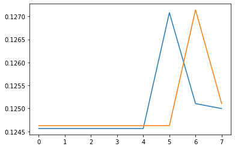
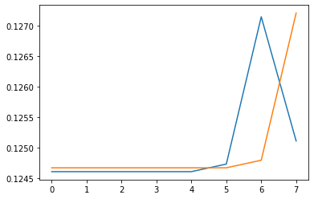

# 予測アルゴリズム

Predictorクラスは、Nステップ先の予測を行います。内部的には、このクラスは Classifiers を使用して SDR を未来の値に関連付けます。このクラスは、データポイントの欠落を処理します。


```python
sequence = [ SDR( 1000 ).randomize( 0.02 ) for i in range(4) ]

labels = [ 4, 5, 6, 7 ]

pred = Predictor([ 1, 2 ])
pred.learn( 0, sequence[0], labels[0] )
pred.learn( 1, sequence[1], labels[1] )
pred.learn( 2, sequence[2], labels[2] )
pred.learn( 3, sequence[3], labels[3] )
pred.reset()

A = pred.infer( sequence[0] )
numpy.argmax( A[1] )  ->  labels[1]
numpy.argmax( A[2] )  ->  labels[2]

B = pred.infer( sequence[1] )
numpy.argmax( B[1] )  ->  labels[2]
numpy.argmax( B[2] )  ->  labels[3]
```


互換性に関する注意: このクラスは、古い SDRClassifier の代替クラスです。実際の値の推定値は提供されなくなりました。

引数の `steps` は、学習して予測する未来へのステップ数です。 Predictorはステップのリストを受け取ります。

引数 `alpha` は、学習中に重み行列を適応させるために使用されます。`alpha`を大きくすると、データへの適応が速くなります。

サンプルA（ラベル"4"のシーケンスを入力したときの予測）を可視化してみます。



次のステップのラベルが"5"、その次のラベルが"6"であることを尤度（ゆうど）でしめしています。

続いてサンプルB（ラベル"5"のシーケンスを入力したときの予測）を可視化してみます。



次のステップのラベルが"6"、その次のラベルが"7"であることを尤度（ゆうど）でしめしています。

### メソッド

* **`Predictor.infer(...)`**：尤度\(ユウド/likelihoods\)を計算する。引数パターンは、アクティブな入力ビットを含むSDRである。キーが予測ステップ、値がPDFであるディクショナリを返します。PDFについての詳細は、help\(Classifier.infer\)を参照してください。
* **`Predictor.learn(...)`** ：事例データから学ぶ。引数 recordNum は各レコードのインクリメント整数です。 数字の空白はレコードの欠落に対応します。 引数 pattern は、アクティブな入力ビットを含む SDR です。 引数 classification は、現在のカテゴリまたはバケットインデックスです。 **入力に複数のカテゴリがある場合は、リストにすることもできる。**
* **`Predictor.reset(...)`** ：時系列データセットで使用します。

