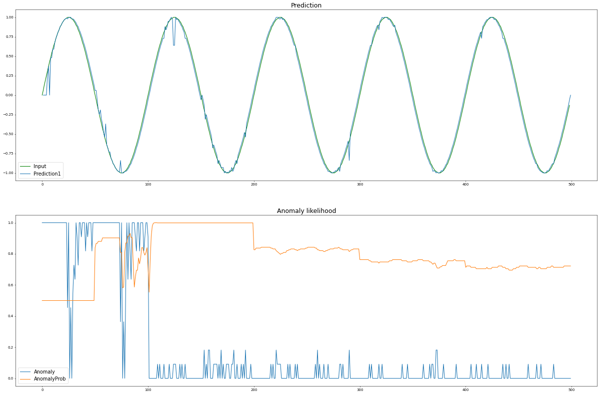

# 異常検知の実装方法

異常検知を実装します。前章の予測アルゴリズムで使用したSine波予測のデータをつかい、異常検知をおこないます。

**`math`** ライブラリと **`AnomalyLikelihood()`** メソッドを追加でインポートします。


```python
import numpy as np
import math

from htm.bindings.sdr import SDR
from htm.bindings.encoders import ScalarEncoder, ScalarEncoderParameters
from htm.algorithms import SpatialPooler as SP
from htm.algorithms import TemporalMemory as TM
from htm.bindings.algorithms import Predictor
from htm.algorithms.anomaly_likelihood import AnomalyLikelihood 

scalarEncoderParams = ScalarEncoderParameters()
scalarEncoderParams.minimum = -1
scalarEncoderParams.maximum = 1
scalarEncoderParams.activeBits = 4
scalarEncoderParams.size = 128
scalarEncoderParams.clipInput  = True

enc = ScalarEncoder(scalarEncoderParams)

inputSDR  = SDR( dimensions = (128, ) )
activeSDR = SDR( dimensions = (576,) )
sp = SP(inputDimensions  = inputSDR.dimensions,
        columnDimensions = activeSDR.dimensions,
        localAreaDensity = 0.02,
        globalInhibition = True,
        seed             = 1,
        synPermActiveInc   = 0.01,
        synPermInactiveDec = 0.008)

tm = TM(
    columnDimensions = (576,),
    cellsPerColumn=8,
    initialPermanence=0.5,
    connectedPermanence=0.5,
    minThreshold=8,
    maxNewSynapseCount=20,
    permanenceIncrement=0.1,
    permanenceDecrement=0.0,
    activationThreshold=8,
)
```


**`Predictor()`** のステップ数を定義します。


```python
predictor = Predictor( steps=[1,2,3,4,5])
```


ここから異常検知クラス **`AnomalyLikelihood()`** を定義します。パラメーターはHTMのサンプルアプリケーション『HotGym』を参照します。インポートしたメソッドにより、The Numenta Anomaly Benchmark \(NAB\) のパラメータを自動でコピーしてくれます。


```python
rows = 500

# anomary
probationaryPeriod = int(math.floor(float(0.1)*rows))
learningPeriod     = int(math.floor(probationaryPeriod / 2.0))
anomaly_history = AnomalyLikelihood(learningPeriod= learningPeriod,
                                  estimationSamples= probationaryPeriod - learningPeriod,
                                  reestimationPeriod= 100)
anomaly     = []
anomalyProb = []
```



```python
sine_wave={}
predictions = {1: [], 2: [], 3: [], 4: [], 5: []}
for i in range(rows):
    angle = (i * np.pi) / 50.0
    sine_value = np.sin(angle)
    sine_wave[i]=round(sine_value,2)
    
    inputSDR = enc.encode(sine_wave[i])
    sp.compute(inputSDR, True, activeSDR)

    tm.compute( activeSDR, learn=True)
    
    predictor.learn(i, tm.getActiveCells(), int(list(sine_wave)[i]))

    pdf = predictor.infer( tm.getActiveCells() )
    for n in (1,2,3,4,5):
        if pdf[n]:
            predictions[n].append( sine_wave[np.argmax( pdf[n] )] )
        else:
            predictions[n].append(float("nan"))
    
    anomalyLikelihood = anomaly_history.anomalyProbability( list(sine_wave)[i], tm.anomaly )
    
    anomaly.append( tm.anomaly )
    anomalyProb.append( anomalyLikelihood )
```


異常値自体は一時記憶のメソッド **`tm.anomaly`** で抽出できます。異常検知率は以下のメソッドで抽出します。

**`anomalyProbability( value, anomalyScore, timestamp)`**

ここでは予測アルゴリズムで使用した「バケットラベル」と、「異常値」を異常検知の分類器に入力します。



可視化すると上記のようになります。

