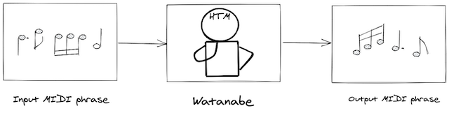
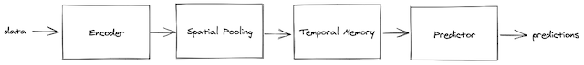

# 機械知能ワタナベ（1）

### 目的

『ワタナベ』の目的は、音楽のフレーズをきっかけに、その続きのフレーズを思い出すというものです。『考える脳考えるコンピューター』のなかでシーケンス学習・予測の例として音楽がよく使われていたので、今回アルゴリズムをつかってそれを再現しようと試みたというわけです。

音楽をデータで抽出するために今回は 『[music21](http://web.mit.edu/music21/)』 を使いました。これはMidi形式で保存された音楽のデータを分析できるPythonライブラリで、最近は機械学習でよく使われています。

この『Music21』をつかい、『[ノルウェーの森](https://ja.wikipedia.org/wiki/%E3%83%8E%E3%83%AB%E3%82%A6%E3%82%A7%E3%83%BC%E3%81%AE%E6%A3%AE)』を『ワタナベ』に学習させ、音階と拍数を微妙にはずしたMidiファイルに対して予測が正しくおこなえるか検証してみます。

#### 入力フレーズ

#### 出力フレーズ

『ノルウェーの森』の導入部分「ターンタ・タタタ・ターン」のあとに「タンタ・タタター・タラッタター」と正しく出力されました。（脳内再生してください）

『ワタナベ』は一部欠けた入力に対して、時間的なパターンをよびだしています。言い換えればこれは新皮質のおこなう「自己連想記憶」を再現しています。さて、これらはどの様な処理をおこなっているのでしょうか。ライブラリの使い方を中心にもう少し詳しくみていきましょう。

### 仕組み

HTMは時系列をともなう分類や異常検知に効果を発揮します。『ワタナベ』は最終的に分類予測をおこなうので、上の図のような仕組みで動作します。

HTMの特徴として、新皮質のニューロンがまばらに活性化されることにヒントを得た、**スパース分散表現（SDR/Sparse Distributed Representations）**により情報を処理することがあげられます。最初におこなう処理は入力データをSDRに**エンコード（Encode）**することです。

HTMの入力に対する学習と推論は、**空間プーリング（SP/Spatial Pooling）**アルゴリズムによっておこなわれます。また、シーケンス学習と予測は、**一時記憶（TM/Temporal Memory）**アルゴリズムによっておこなわれます。

SPとTMの学習・予測は、新皮質のニューロンがシナプスの発火により伝達効率が増強・減少すること（ヘッブの法則）をモデルにおこなわれます。

時系列をともなう分類は、最尤推定（さいゆうすいてい/maximum likelihood estimation）によっておこなわれます。入力データのラベルとTMで学習したアクティブ状態のセルをもとに分類器を学習し、予測します。

### 必要なライブラリ

『ワタナベ』はPython3系で動作します。以下のライブラリが必要になります。

* [htm.core](https://github.com/htm-community/htm.core)
* [numpy](https://numpy.org/)
* [matplotlib](https://matplotlib.org/users/installing.html)
* [music21](http://web.mit.edu/music21/)
  * [musescore](https://musescore.org/ja)
  * [pygame](https://www.pygame.org/news)

『htm.core』は前述の通りコア部分がC++ですので、インストールにC言語のコンパイラが必要になります。64BitのMac、PC、Linuxで動作します。実行にはPython3系のラッパーライブラリを使用するので、データ処理の大半はNumpyによっておこないます。

『music21』は、楽譜の生成とサウンド再生を外部アプリに依存します。そのため、楽譜生成アプリ『musescore』とゲーム作成エンジン『pygame』が必要になります。

