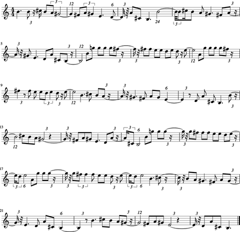
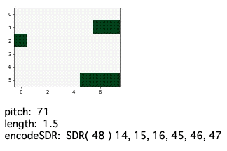

# 機械知能ワタナベ（2）

### データの前処理

『ワタナベ』の最終目的は音符のシーケンス予測をおこなうことです。そのため時系列順にラベル付けされたデータが必要になります。

『Music21』をつかってMidiデータの音符を「音階」と「拍数」にパースし、それらを入力データとしてつかいます。学習用データのもとになるMidiファイルは、以下のサイトよりダウンロードしました。

[freemidi.org/Norwegian Wood Midi](https://freemidi.org/download3-1118-norwegian-wood-beatles)

データの前処理は以下のようにおこないました。


```python
from music21 import *

# Midiファイルを読み込み
inputMidi = converter.parse('./data/NorwegianWood.mid')
# 2番目の楽器を使用
parseMidi = inputMidi.parts[1].recurse()
# 音階（Midi番号）と拍数を配列に格納
notes = []
for element in parseMidi:
    if isinstance(element, note.Note):
        notes.append([int(element.pitch.ps),float(round(element.quarterLength,6))])

# 辞書型に格納
notesDict={}
for i in range(len(notes)):
    notesDict[i]=notes[i] 
print(notesDict)
```


複数の楽器で構成されているMidiファイルから `recurse()` メソッドをつかい主旋律を抽出します。この場合は2番目の楽器です。音符は `note.Note` メソッドで格納されているので、そこから「音階」と「拍数」をパースし、それぞれ配列に格納します。各音符のラベルが必要になるため、配列を辞書型に格納します。


```bash
{0: [71, 1.5], 1: [71, 0.333333], 2: [73, 0.25], 3: [71, 0.5], 4: [69, 0.333333],(略),131: [64, 1.5], 132: [62, 0.5], 133: [69, 0.5], 134: [61, 0.5], 135: [59, 1.5]}
```


ラベル数135の辞書型が取得できました。せっかくなので楽譜を生成し、サウンドを再生してみましょう。


```python
# ストリーミングデータを定義
s1 = stream.Stream()

# 辞書型から音階（Midi番号）と拍数を音符に代入し、ストリーミングデータへ入力する
for n in range(len(list(notesDict))):
    noteMidi = notesDict[n][0]
    noteLength=notesDict[n][1]
    n = note.Note(midi=noteMidi,quarterLength = noteLength)

    s1.append(n)

# ストリーミングデータをもとに楽譜を生成    
s1.show()
# ストリーミングデータをサウンド再生
StreamPlayer=midi.realtime.StreamPlayer(s1)
StreamPlayer.play()
```


『Music21』と連携させた楽譜生成アプリ『musescore』により出力された楽譜は以下のようになります。



同時に『Music21』と連携させたゲームエンジン『pygame』によってサウンドが再生されます。

### エンコード（Encode）

辞書型のバリュー要素は「音階」と「拍数」の配列が格納されています。これらをSDR形式に変換します。『htm.core』の`SDR()` メソッドと **`ScalarEncoder()`** メソッドを利用します。


```python
import numpy as np

from htm.bindings.sdr import SDR
from htm.bindings.encoders import ScalarEncoder, ScalarEncoderParameters
from htm.algorithms import SpatialPooler as SP
from htm.algorithms import TemporalMemory as TM
from htm.bindings.algorithms import Predictor
```


必要なライブラリをインポートします。


```python
# 「音階」をサイズ24、オンビット3のSDRに変換するエンコーダーを定義
pitchParams = ScalarEncoderParameters()
pitchParams.minimum = 48
pitchParams.maximum = 83
pitchParams.activeBits = 3
pitchParams.size = 24
pitchParams.clipInput  = True

encPitch = ScalarEncoder(pitchParams)

# 「拍数」をサイズ24、オンビット3のSDRに変換するエンコーダーを定義
lengthParams = ScalarEncoderParameters()
lengthParams.minimum = 0
lengthParams.maximum = 1
lengthParams.activeBits = 3
lengthParams.size = 24
lengthParams.clipInput  = True

encLength = ScalarEncoder(lengthParams)
```


SDRのサイズとオンビットの数、入力データの最大値・最小値を指定します。ここでは音階48度〜83度、拍数0〜1（4/4拍子を1とする）の2つのエンコーダーを作成しました。SDRサイズは24、オンビット3と指定しています。

エンコードのメソッドは**`ScalarEncoder.encode(入力データ)`**でSDR形式にエンコードされます。今回は2種類エンコードしますので、2つのSDRはnumpyの **`concatenate()`** メソッドをつかい結合させます。データをストリーミング状に入力したものを可視化してみます。



可視化するとこのようになります。可視化のためにSDRを8x6サイズで表示していますが、実際は48ビット、オンビット6の1次元配列であることに注意してください。可視化した図でいうと上半分が音階、下半分が拍数をあらわしています。この様にSDRはひとつのデータで複数の表現を含めることができます。

