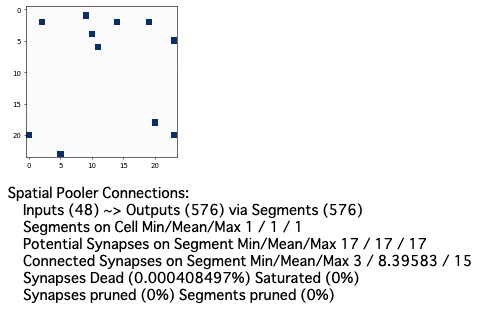

# 機械知能ワタナベ（3）

### 空間プーリング（SP/Spatial Pooling）

エンコードされたSDRは、空間プーリング（SP/Spatial Pooling）と呼ばれるアルゴリズムによって意味を学習し、推論をおこないます。


```python
# 入力SDRの次元を定義
inputSDR  = SDR( dimensions = (48, ) )
# 出力SDRの次元を定義
activeSDR = SDR( dimensions = (576,) )
# 空間プーラーのパラメーターを定義
sp = SP(inputDimensions  = inputSDR.dimensions,
        columnDimensions = activeSDR.dimensions,
        localAreaDensity = 0.02,
        globalInhibition = True,
        seed             = 1,
        synPermActiveInc   = 0.01,
        synPermInactiveDec = 0.008)
# 空間プーラーと入力の接続状態を表示
print(sp)
```


ここでは入力サイズ48に対して出力576、スパース値0.02で指定しています。SP層と入力層の接続状態を確認してみましょう。


```bash
Spatial Pooler Connections:
    Inputs (48) ~> Outputs (576) via Segments (576)
    Segments on Cell Min/Mean/Max 1 / 1 / 1
    Potential Synapses on Segment Min/Mean/Max 17 / 17 / 17
    Connected Synapses on Segment Min/Mean/Max 3 / 8.3941 / 15
    Synapses Dead (0%) Saturated (0%)
    Synapses pruned (0%) Segments pruned (0%)
```


初期値では興奮したなシナプスが0となっていることが確認できます。SPの学習・推論は **`SP.compute(入力SDR, True, 出力SDR)`**メソッドでおこないます。データを入力した空間プーリングを可視化してみましょう。



入力データと同じく可視化のため24x24に変形していますが、実際はサイズ576の１次元データであることに注意してください。興奮したシナプスの強度により空間プーリング層と入力層の接続が更新されていることに注目してください。

### 一時記憶（TM/Temporal Memory）

空間プーリングにより疎状態に変換されたSDRは、一時記憶（TM/Temporal Memory）と呼ばれるアルゴリズムによって時間ごとのセル同士の接続を学習し、予測をおこないます。

TM層のアクティブ状態のセルは、次にどのセルが興奮するかを表現します。


```python
# 一時記憶のパラメーターを定義
tm = TM(
    columnDimensions = (576,),
    cellsPerColumn=8,
    initialPermanence=0.5,
    connectedPermanence=0.5,
    minThreshold=8,
    maxNewSynapseCount=20,
    permanenceIncrement=0.1,
    permanenceDecrement=0.0,
    activationThreshold=8,
)
# 一時記憶のセル同士の接続状態を表示
print(tm)
```


ここでは空間プーリングの出力576ビットを入力空間とし、重ねる層を8と設定しています。これにより8x576ビットの一時記憶空間を設定します。重ねる層は8以上でないと時間記憶が正しく動作しないようです。TM層のセル間の接続状態を確認してみましょう。


```bash
Temporal Memory Connections:
    Inputs (0) ~> Outputs (4608) via Segments (0)
    Segments on Cell Min/Mean/Max 0 / 0 / 0
    Potential Synapses on Segment Min/Mean/Max 4294967295 / nan / 0
    Connected Synapses on Segment Min/Mean/Max 65535 / nan / 0
    Synapses Dead (nan%) Saturated (nan%)
    Synapses pruned (nan%) Segments pruned (nan%)
```


ここではオンビットの可能性があるシナプスが６万5千個あるのが見て取れます。

TMの学習・予測は **`TM.compute(入力SDR, True)`**メソッドでおこないます。空間プーリングから入力されたデータをもとに学習・予測する様子を可視化してみます。


可視化のため8x24x24で表示していますが、実際は8x526の２次元データであることに注意してください。

一時記憶は学習後、2つのステップに分かれてアルゴリズムを実行します。学習時、ミニカラム（縦に並んだセル。ここでは８個）がはじめてのデータを参照する際、それらは予測にないためバースト（Burst）が発生します。つまり、ミニカラムのすべてのセルがそのシーケンスを学習しようとします。

学習後、ひとつめのステップが実行されます。バーストしたミニカラムでは、特定のセルのみがアクティブになります。ふたつめのステップでは、特定のセルがアクティブになったと識別されると、次に発火する複数のセルが予測されます。単純化した例は以下のようになります。

* 「A→B→C→D→X→B→C→Y」で学習後
* 「A→B'→C'」ならば「D」と予測
* 「X→B"→C"」ならば「Y」と予測
* TM層のアクティブセルは入力「C」に対し過去の学習から「C'」と「C"」どちらも表現できる

これによってTM層のアクティブカラムを時系列に沿って分類すれば、そのセルが過去にアクティブになった記憶をもとに、将来どのセルが興奮するかを予測できます。

