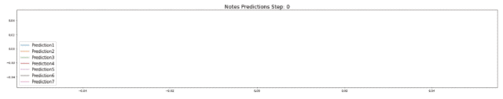

# 機械知能ワタナベ（4）

### 予測（Predictor）

入力データをラベルをつけた辞書型に格納したのはここで分類予測をおこなうためです。辞書型のキーをラベルとし、TM層のアクティブカラムを分類器で学習させることで、数ステップ先のラベルを予測できます。


```python
predictor = Predictor( steps=[1,2,3,4,5,6,7], alpha=0.1)
```


『htm.core』では、`Predictor()` メソッドが用意されており、分類器が何ステップ先まで予測するか指定できます。ここでは7ステップ先まで予測を得るように指定しました。

これによって、前述の例でいえば以下のような分類予測がおこなえます。

* 「E→B→C」の入力があったならば
* 出力されたアクティブセルが「A→B'→C'」に近ければ「D」と予測
* 出力されたアクティブセルが「X→B"→C"」に近ければ「Y」と予測

この「近さ」＝「尤（もっと）もらしさ」を分類するのに尤度（ゆうど）を使うというわけです。どのような形式で出力されるかみてみましょう。


```python
predictions = {1: [], 2: [], 3: [], 4: [], 5: [], 6: [], 7: []}
for i in range(len(notesDict)):
    pitchBits        = encPitch.encode(notesDict[i][0])
    lengthBits = encLength.encode(notesDict[i][1])

    inputSDR = SDR( dimensions = (48, ) ).concatenate([pitchBits, lengthBits])
    sp.compute(inputSDR, True, activeSDR)

    tm.compute( activeSDR, learn=True)

    predictor.learn(i, tm.getActiveCells() ,list(notesDict)[i])

    pdf = predictor.infer( tm.getActiveCells() )
    for n in (1,2,3,4,5,6,7):
        if pdf[n]:
            predictions[n]=notesDict[list(notesDict)[np.argmax( pdf[n] )] ] 
        else:
            predictions[n]=float('nan')

print(predictions)
```


**`predictor()`**メソッドで定義する分類器の学習は **`predictor.learn(ステップ数, アクティブセル,分類ラベル)`** でおこない、推測（尤もらしさ）は**`predictor.infer(アクティブセル)`** で得られます。

この推測は学習のステップ数に対して、入力となるアクティブセルの尤度（ゆうど）で示されます。その中の最大値を予測としてみなします。グラフで出力しますので確認してみましょう。



これは最初の50ステップまでの尤度（ゆうど）を表すグラフです。X軸がステップ数でY軸がnステップ先の予測尤度（ゆうど）をあらわします。


続いて100ステップ以降の尤度（ゆうど）を表すグラフです。楽譜と比較すると似たフレーズの部分の山が高くなっているのがわかると思います。

### テスト

テスト用に音階と拍数を少し外したデータを用意します。


```python
testNotesDict ={0:[71, 1.5], 1:[71, 0.5], 2:[74, 0.25], 3:[71, 0.25], 4:[69, 0.25], 5:[68, 1.5], 6:[66, 0.5]}
```


『Music21』でフレーズを確認してみましょう。


```python
s2 = stream.Stream()

for n in range(len(list(testNotesDict))):
    noteMidi = testNotesDict[n][0]
    noteLength=testNotesDict[n][1]
    n = note.Note(midi=noteMidi,quarterLength = noteLength)

    s2.append(n)

print("Score of testMidi.mid")
s2.show()
StreamPlayer=midi.realtime.StreamPlayer(s2)
StreamPlayer.play()
```



冒頭で添付した入力データです。これを学習済みの『ワタナベ』に入力します。


```python
testPredictions = {1: [], 2: [], 3: [], 4: [], 5: [], 6: [], 7: []}

for i in range(len(list(testNotesDict))):
    pitchBits        = encPitch.encode(testNotesDict[i][0])
    lengthBits = encLength.encode(testNotesDict[i][1])

    inputSDR = SDR( dimensions = (48, ) ).concatenate([pitchBits, lengthBits])
    sp.compute(inputSDR, True, activeSDR)

    tm.compute( activeSDR, learn=True)

    pdf = predictor.infer( tm.getActiveCells() )
    for n in (1,2,3,4,5,6,7):
        if pdf[n]:
            testPredictions[n]=notesDict[list(notesDict)[np.argmax( pdf[n] )] ] 
        else:
            testPredictions[n]=float('nan')

print(testPredictions)
```


分類器の学習`predictor.learn()`はおこないません、推測の最大値から予測を得る際、学習時に使った辞書型をつかいますので注意してください。

得られた予測を『Music21』で確認してみます。


```python
s3 = stream.Stream()

for n in range(len(predictions)):
    noteMidi = testPredictions[n+1][0]
    noteLength=testPredictions[n+1][1]
    n = note.Note(midi=noteMidi,quarterLength = noteLength)

    s3.append(n)

s3.show()
StreamPlayer=midi.realtime.StreamPlayer(s3)
StreamPlayer.play()
```



『ワタナベ』は、音楽のフレーズをきっかけに、その続きのフレーズを思い出すことができました。

